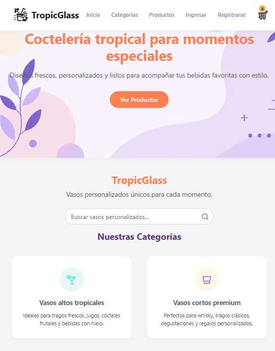

# React + Vite

El proyecto TropicGlas se desarrolla con la librería de ReactJSX y la herramienta Vite como el motor que prepara, empaqueta y actualiza la API desde el código JSX hasta el CSS configurándose para varios navegadores. 

## Estructura
La estructura se organiza de acuerdo a las rutas para su conexión con los tres requerimientos del proyecto como sigue: (por mejorar la ruta)


```txt
proyecto-reactjsx-2026
  └──public/
  │   └── images/
  └── src
    └── componentes (mejorar)
   └── main.jsx
      └── BrowserRouter
    └── App.jsx
        └── Layout.jsx
            ├── Header.jsx
            │   └── Navbar.jsx
            ├── Routes
            │   ├── Home.jsx
            │   ├── Productos.jsx
            │   │   └── ItemListContainer.jsx
            │   │       └── ItemList.jsx
            │   │           └── Item.jsx
            │   ├── ProductoDetalle.jsx
            │   └── Carrito.jsx
            └── Footer.jsx
   ```

```txt
public/
└── data/
    └── productos.json

src/
├── components/
│   ├── Layout/
│   │   ├── Header.jsx
│   │   ├── Header.css
│   │   ├── Navbar.jsx
│   │   ├── Navbar.css
│   │   ├── Footer.jsx
│   │   ├── Footer.css
│   │   ├── Layout.jsx
│   │   └── Layout.css
│   │
│   └── catalog/
│       ├── ItemListContainer.jsx
│       ├── ItemListContainer.css
│       ├── ItemList.jsx
│       ├── ItemList.css
│       ├── Item.jsx
│       └── Item.css
├── data/
│   ├── productos.json/
├── pages/
│   ├── Carrito.jsx/
│   ├── Categorias.jsx/
│   ├── Home.jsx/
│   ├── ProductoDetalle.jsx/
│   ├── Productos.jsx/
│
├── App.jsx
├── main.jsx
└── index.css
```

# Continuidad con los dos requerimientos...

# 🍹 TropicGlass — E-commerce de Vasos Premium

Breve descripción del proyecto: Aplicación web interactiva desarrollada en React que simula una tienda en línea moderna para la venta de cristalería y vasos exclusivos, ofreciendo una experiencia fluida e intuitiva al usuario.
El proyecto TropicGlas se desarrolla con la librería de ReactJSX y la herramienta Vite como el motor que prepara, empaqueta y actualiza la API desde el código JSX hasta el CSS configurándose para varios navegadores.

## 🎯 Objetivos del Proyecto
* **Implementar un CRUD completo de sesión:** Permitir la gestión total de productos dentro de un carrito de compras.
* **Optimización Responsive Total:** Garantizar una visualización adaptada desde dispositivos móviles pequeños hasta pantallas de escritorio.
* **Modularidad:** Estructurar el código en componentes reutilizables y escalables mediante Context API.

---

## 🛠️ Requerimientos Técnicos Implementados
1. **Gestión de Carrito sin Duplicados:** Al agregar un producto existente, se incrementa la cantidad de forma automática sin duplicar la tarjeta visual.
2. **Controles Interactivos de Cantidad:** Incorporación de botones contextuales (`+` y `−`) tipo píldora dentro del carrito. El botón muta dinámicamente a papelera (`🗑️`) al llegar a la unidad mínima (1) para mejorar la UX.
3. **Persistencia y Flujo:** Control dinámico de totales, subtotales y cantidades totales reflejadas en el Navbar en tiempo real.
4. **Gestión de Autenticación de Administrador de Usuario:** Sistema de autenticación con registro, inicio de sesión y autorización mediante AuthContext.


---

## 📁 Estructura del Proyecto

La arquitectura del proyecto está organizada de manera modular basándose en rutas funcionales y componentes especializados para conectar con los requerimientos esenciales:

<details>
<summary>📂 Haz clic aquí para desplegar el árbol de archivos</summary>

```text
public/
└── data/
    └── productos.json        # Base de datos simulada

src/
├── components/
│   ├── Layout/              # Componentes de estructura global
│   │   ├── Header.jsx / .css
│   │   ├── Navbar.jsx / .css
│   │   ├── Footer.jsx / .css
│   │   └── Layout.jsx / .css
│   │
│   └── catalog/             # Gestión de visualización de productos
│       ├── ItemListContainer.jsx / .css
│       ├── ItemList.jsx / .css
│       └── Item.jsx / .css
│
├── context/                 # Estado global de la aplicación (CRUD)
│   └── CartContext.jsx
│
├── pages/                   # Vistas principales de la aplicación
│   ├── Carrito.jsx
│   ├── Categorias.jsx
│   ├── Home.jsx
│   ├── ProductoDetalle.jsx
│   └── Productos.jsx
│
├── App.jsx                  # Enrutador principal
├── main.jsx
└── index.css


📸 Capturas de Pantalla (Vistas Principales)✨ 
Sugerencia de UX: Para mantener el archivo limpio, mostramos las vistas en una tabla organizada que compara el diseño Desktop vs Móvil.Vista de Escritorio (Tablet/Laptop)Vista Móvil.

